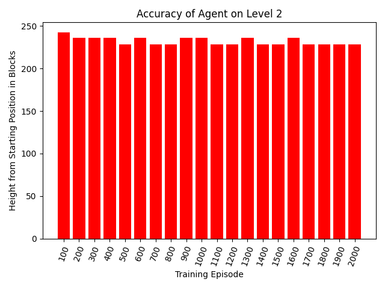

## Final Report Video
<iframe width="560" height="315" src="URL HERE" frameborder="0" allow="accelerometer; autoplay; clipboard-write; encrypted-media; gyroscope; picture-in-picture" allowfullscreen></iframe> 

## Project Summary
The goal of this project is to create an AI that can play the map The Dropper by Bigre. In the map, the player must complete 16 different levels (of which we focus on the first four); in each level the agent starts off at the top of a large drop and must control themselves as they fall—with the goal of landing safely in water located at the bottom of each level.  Each level increases in difficulty by adding more blocks and structures the agent must avoid hitting along with changing the position, direction, and shape of the water.  One of the key features we set for this project was to create an A.I. that plays as if it were human, that is, no instantaneous movement, it is unable to see the entire map, and it can only perform an action 4 to 5 times per second (simulating human reaction time).  The model for the A.I. uses a convolutional neural network that receives information about the blocks surrounding the agent and outputs q-values for the action to take (N, S, E, W, or no action).

## Approaches

### Overview 
In our status report we had the lofty goal of creating a general purpose A.I. that could play any of the Dropper levels, but due to the large observation space required for such a task, along with the water position changing shape and orientation between levels, we quickly realized that there would not be enough time to train a general A.I.  The time was especially limited since each 1000 episode run took 12 hours or more to complete, making the multi-thousand episode training required for a general A.I impractical given our time frame.  
In initial testing, we trained an agent such that between each episode, the level was changed, in the hopes that it would generalize and learn how to play all of them, however, we instead found that after a point no improvement was made.  We believe this happened both because not enough time was given for training and that better training examples were needed (such as a procedurally generated map that has more variation in its obstacles, however, this was impractical to do on the scale of the map we are playing on).  Due to these reasons, we decided to train an A.I. for each individual level, requiring much less training time and far better results.

### Observation Space
The observation space we settled on is 15x15 blocks wide and 100 blocks deep, and while 100 blocks deep may initially seem too big, the player falls that distance in only ~3 seconds, and with continuous movement enabled, that much time is needed to avoid incoming blocks.  The observation space was reduced to contain only three values: air, water, and anything else (0, 1, and 2 respectively).  This simplified the training for our A.I. so that it can easily detect blocks to avoid and the water to target.

### Baseline
Our baseline approach was a random A.I. on each level, which basically always failed once reaching the first obstacle.  This happens because when using continuous movement, the agent hardly has any time to move in the fifth of a second between actions, so the net effect is that the agent stays roughly in its initial position.  This behavior can be good or bad depending on the map, with some requiring large movements and others requiring small changes in position. 

### Our Model
The model chosen is a convolutional neural network that takes in the observation space (blocks), and outputs five probabilities (q-values) for which action to take (N, S, E, W, and no action).  The model consists of two convolutional layers each with max pooling, and three dense layers, with the last dense layer being the action q-values.  This was chosen both by looking at networks created for similar purposes (specifically the Atari Breakout A.I. in the Keras documentation), and through trial and error.  

### Reward Function
To reward the agent during training we took into account four factors: the vertical distance traveled from the starting position *r_dist*, the distance between the agent and the nearest block of water *r_water*, the number of solid blocks surrounding the player in a 10x6x6 cube *r_blocks*, and if the player was in the water or not *r_inwater*.  We then took a linear combination of these factors as our reward function:

$$ R(s) = 4r_dist + 2000r_water -5r_blocks + 100000r_inwater $$

While the weights of $$R(s)$$ could use more tweaking (especially as the water moves between levels), it was still able to generally guide our agent in the correct direction, with it heavily encouraging the agent to move toward water, discouraging the agent from having blocks nearby (hence the negative weight for $$r_blocks$$), and a huge reward for making it into the water.

## Evaluation
Due to the difficulties in making a general Dropper A.I described above, we transitioned to training a new A.I. individually for levels 1 through 4.  Below are discussion and details for each level.

### Level 0

### Level 1

### Level 2

### Level 3

### Conclusion

## References
Chapman, Jacob, and Mathias Lechner. “Keras Documentation: Deep Q-Learning for Atari Breakout.” *Keras*, 23 May 2020, keras.io/examples/rl/deep_q_network_breakout/.
Microsoft. “Project Malmo Documentation.” *Project Malmo*, microsoft.github.io/malmo/0.17.0/Documentation/index.html.
Sharma, Adiyta. “Convolutional Neural Networks in Python.” *DataCamp Community*, 5 Dec. 2017, www.datacamp.com/community/tutorials/convolutional-neural-networks-python.