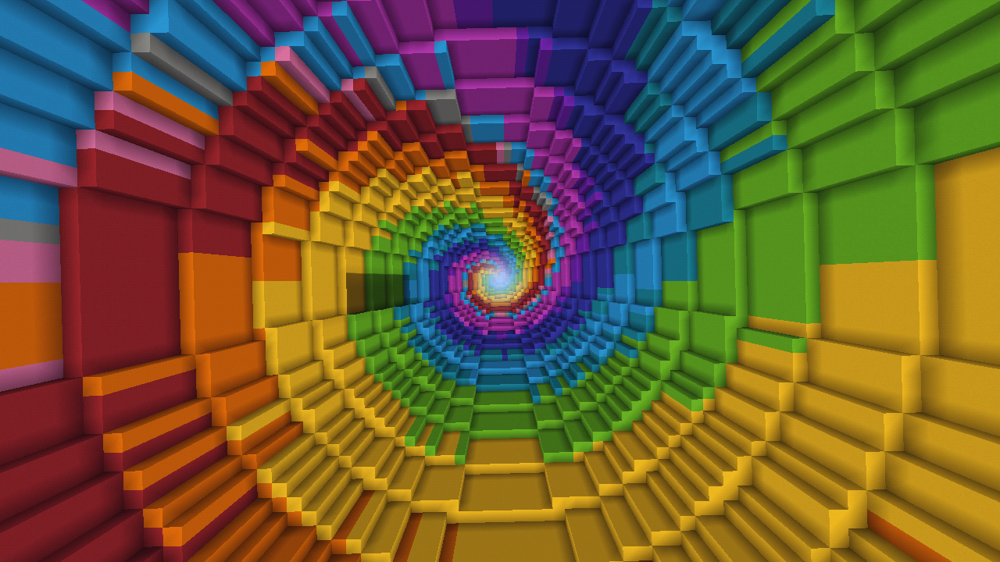

GitHub Repository: [link][gitlink]
[gitlink]:https://github.com/shreya-krishnam/TheUltimateDropper/tree/main/docs

Summary:
The goal of this project is to create an AI that can play the map The Dropper by Bigre. In the map, the player must complete 16 different levels; in each level the player starts off at the top of a large drop and must fall and land in a small puddle of water to avoid dying. On the way down there are several obstacles that will kill the player if they land on it moving too fast, as well as the water at the bottom being positioned differently for each map. For inputs the AI will receive blocks located directly around and below it (to a certain distance, to simulate a player only being able to see a certain distance), it’s distance from the ground level, as well as the target water block(s). The AI output will be simple in that it must specify a direction (NSEW) to strafe in at each time step, as well as determining what block to initially fall from.

Reports:

- [Proposal](proposal.html)
- [Status](status.html)
- [Final](final.html)
