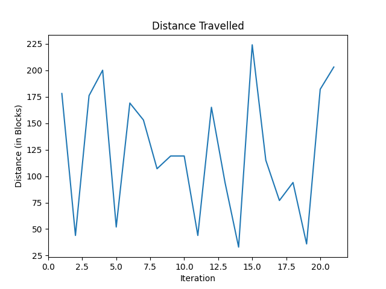
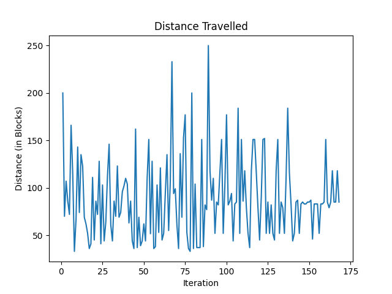

## Status Report Video
<iframe width="560" height="315" src="https://drive.google.com/file/d/1neMBYoPjR8CUXlmiYerhv3NirJMN5eJN/view?usp=sharing" frameborder="0" allow="accelerometer; autoplay; clipboard-write; encrypted-media; gyroscope; picture-in-picture" allowfullscreen></iframe> 

## Project Summary
The goal of this project is to create an AI that can play the map The Dropper by Bigre. In the map, the player must complete 16 different levels; in each level the agent starts off at the top of a large drop and must control themselves as they fall—with the goal of landing safely in water located at the bottom of each level.  Each level increases in difficulty by adding more blocks and structures the agent must avoid hitting.  For inputs—the agent will receive a map of the blocks located directly around and below it (20 x 10 x 10).  The AI then outputs which direction it believes the agent should move (NSEW), or not at all; this is done continuously as the agent falls. The agent is rewarded based on the vertical distance it traveled before failing or succeeding. 

## Approach
Each observation is a numpy array of size (20 x 10 x 10) grid, with the depth being 20 blocks so the agent has time to react to incoming obstacles. If it observes water, air or neither water nor air the observation values in the array are set to 2,0, and 1 respectively. 
As a baseline we used both a random algorithm and the Epsilon - Greedy algorithm to get the actions and the probability. This is either a random action (forward/backward/strafe left/strafe right/stay still) if the probability is less than the epsilon value or the agent chooses to move forward, move backward or strafe left or strafe right according to the observed value in the Q - table. They are set to continuous commands in the XML string as actions continuously vary over time.  
The reward the agent gets is initially set to 0 as there are no rewards at the start location. But as the agents move downwards towards the ground the reward increases based on its absolute vertical difference from the current location and the start location (1 point per block traveled, ~250 if the agent reaches the bottom). If it’s observed that the agent touches the water (it’s destination) it gets a 500 point reward. 
The Q - Network is a Deep Neural Network with 4 layers and the input takes a tensor of the observation size as the number of neurons. The final output layer gives an output of the action size (4 actions) as the number of neurons. All activation layers used a ReLu() activation function.

## Evaluation
The agent will be evaluated on two main factors—how close it gets to the bottom of the level, and if it lands in the water (doesn’t die).  The combination of these two factors we believe will be enough to train an AI to both avoid obstacles while targeting the correct landing position.
Currently, we have a working random agent by randomly choosing one of the four directions to move in, or not at all, at each time step.  Below is a graph showing the distance traveled by the agent across 20 trials (higher is better—with 252 meaning it made it to the bottom since the level is 252 blocks high).

This clearly shows that the distance the agent travels is random and that the agent is not very good, as one would expect.  As we discuss in the next section, we expect this to improve dramatically as we improve our algorithm.
Out of curiosity, we also tested out a Greedy-Epsilon Q-Table algorithm (as used in assignment 2), although we did not expect to use this for our final AI since it is not practical to store a table for all 3*2000! combinations of blocks in our observation space.  Below is a graph showing the AI on a simple level over 175 iterations.

The limitations of this algorithm are shown well here since it is hard to distinguish this between just a random AI—our observation space is just too large for a Q-Table to practically work.

## Remaining Goals and Challenges
 We would like to implement a convolutional neural network as our Q - Network to improve our agent’s performance.  This algorithm will analyze data such that it doesn’t need to store every possible observation state.  For the first run, the agent will not move at all when dropping to obtain general information.  After, we will have the agent start with random movements and then slowly adjust with the analysis of previous drops. We will try to create a CNN that will adequately assess the information and result in an agent that can land safely in the water. Our end goal is to have an AI that works “well” on any level, but may need some time to learn the specifics of each level.

## Resources Used 
As of now we have mostly used the Malmo documentation since we have not yet implemented a “good” AI: [link](http://microsoft.github.io/malmo/0.14.0/Documentation/index.html)
